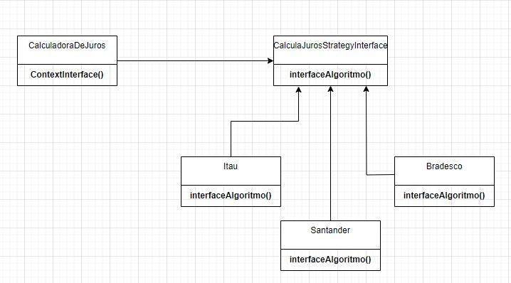

# Padrões de Projetos em Java
>* [Adapter](#adapter)
>* [Singleton](#singleton)
>* [Strategy](#strategy)
>* [Builder](#builder)

## Strategy
É um padrão comportamental. Ele é ideal para encapsular algoritmos similares para tomar alguma decisão.

 

`Casos de uso:` A partir de um pedido, calcular o juros referente a cada banco.

* Status: Em desenvolvimento ⚠️
